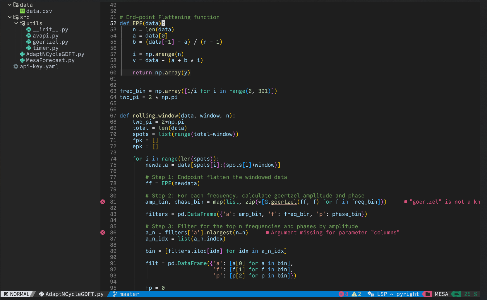

## About

This is a Dark+ color theme for the neovim plugin [NvChad](https://github.com/NvChad/NvChad) since I noticed there wasn't one readily available.

This is about as accurate as it can be made since some of the colors in VS Code are due to the pylance LSP being more extensible than pyright, so things like imports take on the color of variables rather than modules, for instance.



## Installation

First, `darkplus.lua` should be added to `lua/themes/` (create the `themes` folder if it is not there already in the `nvim` directory).


Add `rainbow-delimiters.nvim` to `lua/plugins/init.lua` for VS Code-like delimiters:

```lua
  {
    "hiphish/rainbow-delimiters.nvim",
  },
```


Add the following to the main `init.lua`:

```lua
-- Rainbow Delimiters
local rainbow_delimiters = require 'rainbow-delimiters'

---@type rainbow_delimiters.config
vim.g.rainbow_delimiters = {
    strategy = {
        [''] = rainbow_delimiters.strategy['global'],
        vim = rainbow_delimiters.strategy['local'],
    },
    query = {
        [''] = 'rainbow-delimiters',
        lua = 'rainbow-blocks',
    },
    priority = {
        [''] = 110,
        lua = 210,
    },
    highlight = {
        'RainbowDelimiterYellow',
        'RainbowDelimiterViolet',
        'RainbowDelimiterBlue',
        'RainbowDelimiterYellow',
        'RainbowDelimiterViolet',
        'RainbowDelimiterBlue',
        'RainbowDelimiterRed',
    },
}

-- VSCode Dark+ rainbow delimiter colors
vim.cmd("highlight RainbowDelimiterYellow  guifg=#ffc912 ctermfg=White")
vim.cmd("highlight RainbowDelimiterViolet  guifg=#d26ad6 ctermfg=White")
vim.cmd("highlight RainbowDelimiterBlue  guifg=#179efe ctermfg=White")
```


Lastly, change the theme name in `chadrc.lua` to "darkplus" like so:

```lua
M.base46 = {
	theme = "darkplus",

	-- hl_override = {
	-- 	Comment = { italic = true },
	-- 	["@comment"] = { italic = true },
	-- },
}

return M
```